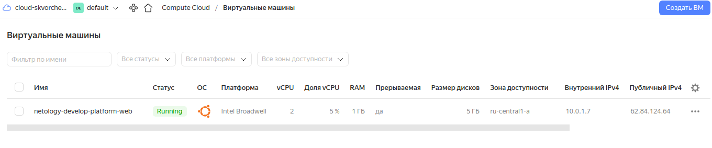
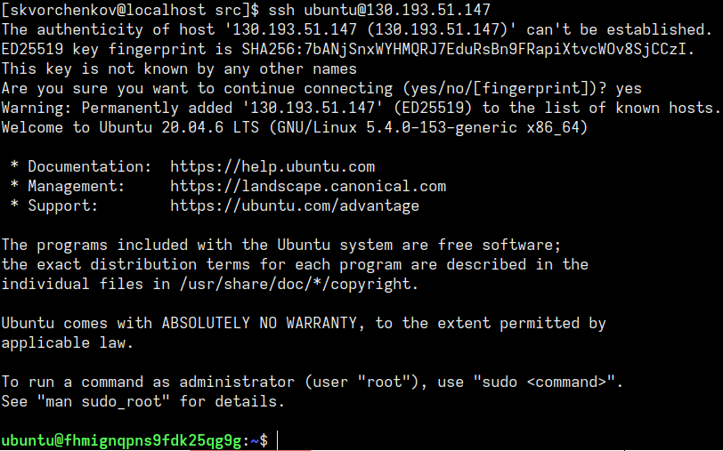
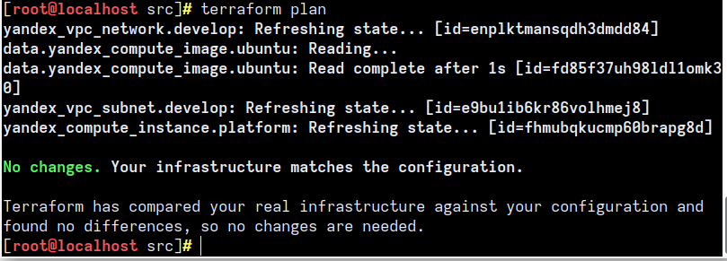
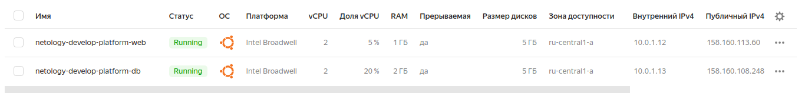
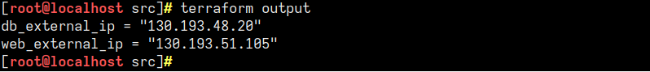

# Домашнее задание к занятию «Основы Terraform. Yandex Cloud»

## Задача 1
В качестве ответа всегда полностью прикладываете ваш terraform-код в git!

1. Изучите проект. В файле variables.tf объявлены переменные для yandex provider.
2. Переименуйте файл personal.auto.tfvars_example в personal.auto.tfvars. Заполните переменные (идентификаторы облака, токен доступа). Благодаря .gitignore этот файл не попадет в публичный репозиторий. **Вы можете выбрать иной способ безопасно передать секретные данные в terraform.**
3. Сгенерируйте или используйте свой текущий ssh ключ. Запишите его открытую часть в переменную **vms_ssh_root_key**.
4. Инициализируйте проект, выполните код. Исправьте намеренное допущенные ошибки. Ответьте в чем заключается их суть?
5. Ответьте, как в процессе обучения могут пригодиться параметры```preemptible = true``` и ```core_fraction=5``` в параметрах ВМ? Ответ в документации Yandex cloud.

В качестве решения приложите:
- скриншот ЛК Yandex Cloud с созданной ВМ,
- скриншот успешного подключения к консоли ВМ через ssh(к OS ubuntu необходимо подключаться под пользователем ubuntu: "ssh ubuntu@vm_ip_address"),
- ответы на вопросы.

## Ответ:
1. В файл variables.tf внес свой текущий ssh ключ.

<details>
<summary>Часть кода в variables.tf:</summary>

```sh
###ssh vars
variable "vms_ssh_root_key" {
  type        = string
  default     = "ssh-rsa AAAAB3NzaC1yc2EAAAADAQABAAABgQCwyJ3A7ejWrc8zrubKHU/QnVkCiQeREs7YqXNxpPLacXVRKBSEyC5D8nFQtUZcYCprLOKFXZqwmpUH5TVn0rONjZx1R1cvO9sa3lDm6DrpbIVQqGDYCJ+GerAtzYYDnL51z+daKrT9cqa2LdvTzEWfDyB7+gujFiJrGLnFA1pJeN1x6jHj/V7hXm0y88uW/G6AZWnGfvgJzUj5B7AMdRBjR3YGDTbnjcgnHLCNoO4nefHqMBiEZ7FibNqi1GqSi243GtBVNq8BMlHZyWucPG7IeUBHZ93gf9eLbN5nGx2E4TGZIcKjSH9QYptgXEi19HDE4wqYCexCNBTuwSN2YHWBD6B3MEnwKA2R1GtNM/rH69+puXZJx3p/qidSmQwQvdsVze4uJf4v+UEJvGbg06ce9VFjfoaiLFNLNKIVP1xqrZTHtWQeX9mqYZ3KrmNvzO843Eb9nqn5fyGDjkK600bAeg6tlB+jkFNu9PY28NLiasCfnRovBtvUm2esKqWQ/BE= skvorchenkov@localhost.localdomain"
  description = "ssh-keygen -t ed25519"
}
```   
</details>

------

- <details>
<summary>Вывод консоли 1:</summary>

```sh
yandex_vpc_network.develop: Creating...
yandex_vpc_network.develop: Creation complete after 4s [id=enpk9ro8q59lbmjlf967]
yandex_vpc_subnet.develop: Creating...
yandex_vpc_subnet.develop: Creation complete after 2s [id=e9bs6molibhqfut364gt]
yandex_compute_instance.platform: Creating...
╷
│ Error: Error while requesting API to create instance: server-request-id = 1ef1dd75-0c76-4dda-966f-e55d5752104a server-trace-id = eea1811753ae64a7:98efc02e7303946f:eea1811753ae64a7:1 client-request-id = 5ac54b2e-8d2b-4194-8c2d-c5dcea85b15b client-trace-id = c0e91596-1972-4c4a-a8cc-5326bb337599 rpc error: code = FailedPrecondition desc = Platform "standart-v4" not found
│ 
│   with yandex_compute_instance.platform,
│   on main.tf line 15, in resource "yandex_compute_instance" "platform":
│   15: resource "yandex_compute_instance" "platform" {
```   
</details>

<details>
<summary>Вывод консоли 2:</summary>

```sh
yandex_compute_instance.platform: Creating...
╷
│ Error: Error while requesting API to create instance: server-request-id = 087fc86d-bdad-40e7-8982-556a48596ebe server-trace-id = f32711517defe631:15f03a5953f8d67d:f32711517defe631:1 client-request-id = d3012ef7-ed63-4f7f-8cb4-8b6b2979deaa client-trace-id = bd9be09b-b2fe-4eb4-a9fc-2381ee9d7206 rpc error: code = InvalidArgument desc = the specified number of cores is not available on platform "standard-v1"; allowed core number: 2, 4
│ 
│   with yandex_compute_instance.platform,
│   on main.tf line 15, in resource "yandex_compute_instance" "platform":
│   15: resource "yandex_compute_instance" "platform" {
│ 
╵
```   
</details>

2. В первом выводе консоли в main.tf была указана ошибка в написании standart-v4. Исправил на starndard-v1. Во втором выводе консоли указана ошибка с 1 ядром. Чтобы создать ВМ на Yandex Cloud необходимо иметь 2 ядра.
Исправленный кусочек кода в main.tf
<details>
<summary>Исправленные ошибки в main.tf:</summary>

```sh
resource "yandex_compute_instance" "platform" {
  name        = "netology-develop-platform-web"
  platform_id = "standard-v1"
  resources {
    cores         = 2
    memory        = 1
    core_fraction = 5
  }
```   
</details>

------

3. Ответы:
- preemptible = true создание ВМ с прерыванием. Она работает 24 часов и может быть остановлена Compute Cloud в любой момент. Может пригодиться если забыли удалить ресурсы на Yandex Cloud. Чтобы денги не тратились. 
- core_fraction указывает базовую производительность ядра в процентах. Гарантированная доля vCPU, которая будет выделена ВМ. ВМ с гарантированной долей меньше 100% обеспечивают указанный уровень производительности с вероятностью временного повышения вплоть до 100%. Эти ВМ подходят для задач, которые не требуют постоянной гарантии производительности vCPU на 100%.
4. Скриншот ЛК Yandex Cloud с созданной ВМ,

 

5. Скриншот успешного подключения к консоли ВМ через ssh.

 

## Задача 2
1. Изучите файлы проекта.
2. Замените все "хардкод" **значения** для ресурсов **yandex_compute_image** и **yandex_compute_instance** на **отдельные** переменные. К названиям переменных ВМ добавьте в начало префикс **vm_web_** .  Пример: **vm_web_name**.
2. Объявите нужные переменные в файле variables.tf, обязательно указывайте тип переменной. Заполните их **default** прежними значениями из main.tf. 
3. Проверьте terraform plan (изменений быть не должно). 

## Ответ:
<details>
<summary>Код из variables.tf:</summary>

```sh
###cloud vars
variable "token" {
  type        = string
  description = "OAuth-token; https://cloud.yandex.ru/docs/iam/concepts/authorization/oauth-token"
}

variable "cloud_id" {
  type        = string
  description = "https://cloud.yandex.ru/docs/resource-manager/operations/cloud/get-id"
}

variable "folder_id" {
  type        = string
  description = "https://cloud.yandex.ru/docs/resource-manager/operations/folder/get-id"
}

variable "default_zone" {
  type        = string
  default     = "ru-central1-a"
  description = "https://cloud.yandex.ru/docs/overview/concepts/geo-scope"
}
variable "default_cidr" {
  type        = list(string)
  default     = ["10.0.1.0/24"]
  description = "https://cloud.yandex.ru/docs/vpc/operations/subnet-create"
}

variable "vpc_name" {
  type        = string
  default     = "develop"
  description = "VPC network & subnet name"
}

variable "vm_web_image_family" {
  type        = string
  default     = "ubuntu-2004-lts"
  description = "image family"
}

variable "vm_web_instance_name" {
  type        = string
  default     = "netology-develop-platform-web"
  description = "VM name"
}

variable "vm_db_instance_name" {
  type        = string
  default     = "netology-develop-platform-db"
  description = "VM name"
}


###ssh vars

variable "vms_ssh_root_key" {
  type        = string
  default     = "ssh-rsa AAAAB3NzaC1yc2EAAAADAQABAAABgQCwyJ3A7ejWrc8zrubKHU/QnVkCiQeREs7YqXNxpPLacXVRKBSEyC5D8nFQtUZcYCprLOKFXZqwmpUH5TVn0rONjZx1R1cvO9sa3lDm6DrpbIVQqGDYCJ+GerAtzYYDnL51z+daKrT9cqa2LdvTzEWfDyB7+gujFiJrGLnFA1pJeN1x6jHj/V7hXm0y88uW/G6AZWnGfvgJzUj5B7AMdRBjR3YGDTbnjcgnHLCNoO4nefHqMBiEZ7FibNqi1GqSi243GtBVNq8BMlHZyWucPG7IeUBHZ93gf9eLbN5nGx2E4TGZIcKjSH9QYptgXEi19HDE4wqYCexCNBTuwSN2YHWBD6B3MEnwKA2R1GtNM/rH69+puXZJx3p/qidSmQwQvdsVze4uJf4v+UEJvGbg06ce9VFjfoaiLFNLNKIVP1xqrZTHtWQeX9mqYZ3KrmNvzO843Eb9nqn5fyGDjkK600bAeg6tlB+jkFNu9PY28NLiasCfnRovBtvUm2esKqWQ/BE= skvorchenkov@localhost.localdomain"
  description = "ssh-keygen -t ed25519"
}
```   
</details>

Скриншот:

 

## Задача 3
1. Создайте в корне проекта файл 'vms_platform.tf' . Перенесите в него все переменные первой ВМ.
2. Скопируйте блок ресурса и создайте с его помощью вторую ВМ(в файле main.tf): **"netology-develop-platform-db"** ,  cores  = 2, memory = 2, core_fraction = 20. Объявите ее переменные с префиксом **vm_db_** в том же файле('vms_platform.tf').
3. Примените изменения.


## Ответ:

<details>
<summary>Код из vms_platform.tf:</summary>

```sh
### yandex_compute_image vars

variable "vm_db_image_name" {
  type        = string
  default     = "ubuntu-2004-lts"
  description = "release_name_of_image"
}

### yandex_compute_instance vars


variable "vm_db_instance_name" {
  type        = string
  default     = "netology-develop-platform-db"
  description = "name_of_instance"
}

variable "vm_db_cores" {
  type        = number
  default     = 2
  description = "count_of_cores_vm"
}

variable "vm_db_memory" {
  type        = number
  default     = 2
  description = "count_of_memory_vm"
}

variable "vm_db_core_fraction" {
  type        = number
  default     = 20
  description = "core_fraction_of_vm"
}
```   
</details>

Скриншот:

 

## Задача 4
1. Объявите в файле outputs.tf output типа map, содержащий { instance_name = external_ip } для каждой из ВМ.
2. Примените изменения.

В качестве решения приложите вывод значений ip-адресов команды ```terraform output```

## Ответ:
- [outputs.tf](02/src/outputs.tf)

Скриншот:



## Задача 5

1. В файле locals.tf опишите в **одном** local-блоке имя каждой ВМ, используйте интерполяцию ${..} с несколькими переменными по примеру из лекции.
2. Замените переменные с именами ВМ из файла variables.tf на созданные вами local переменные.
3. Примените изменения.

## Ответ:
Файл [locals.tf](02/src/locals.tf)

Описал интерполяцию в файле main.tf.

<details>
<summary>Код из main.tf:</summary>

```sh
resource "yandex_compute_instance" "platform" {
name = "${ local.org }-${ local.project }-${ local.instance }-web"
  platform_id = "standard-v1"
  resources {
    cores         = var.vm_web_cores
    memory        = var.vm_web_memory
    core_fraction = var.vm_web_core_fraction
  }
------
resource "yandex_compute_instance" "vm2" {
   name = "${ local.org }-${ local.project }-${ local.instance }-db"
  platform_id = "standard-v1"
  resources {
    cores         = var.vm_db_cores
    memory        = var.vm_db_memory
    core_fraction = var.vm_db_core_fraction
  }
```   
</details>

## Задача 6

1. Вместо использования 3-х переменных  ".._cores",".._memory",".._core_fraction" в блоке  resources {...}, объедените их в переменные типа **map** с именами "vm_web_resources" и "vm_db_resources". В качестве продвинутой практики попробуйте создать одну map переменную **vms_resources** и уже внутри нее конфиги обеих ВМ(вложенный map).
2. Так же поступите с блоком **metadata {serial-port-enable, ssh-keys}**, эта переменная должна быть общая для всех ваших ВМ.
3. Найдите и удалите все более не используемые переменные проекта.
4. Проверьте terraform plan (изменений быть не должно).

## Ответ:

Описал map ВМ в файлах variables.tf и vms_platform.tf. Описал map с metadata в файле varibles.tf. 

Файл [main.tf](02/src/main.tf)
Файл [variables.tf](02/src/variables.tf)
Файл [vms_platform.tf](02/src/vms_platform.tf)